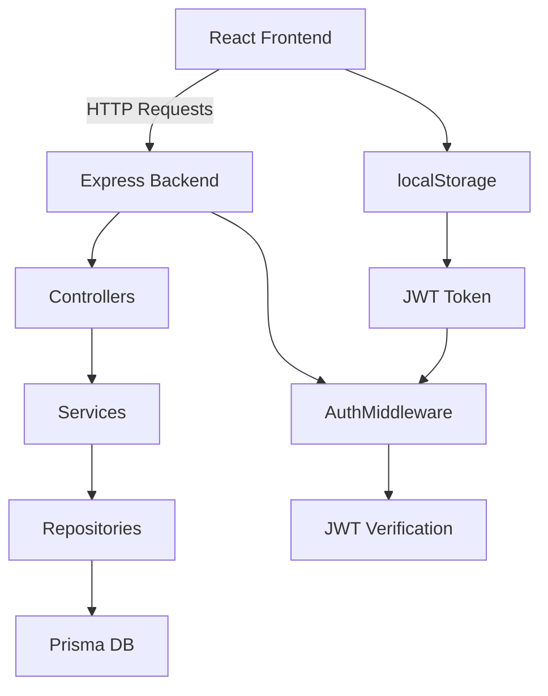

# Gestion des Salaires - Backend

## Description du Projet
Ce projet est une application backend de gestion des salaires qui permet de gérer les employés, les entreprises, les cycles de paie et les bulletins de salaire.

## Structure du Projet

### Configuration et Fichiers de Base

#### `package.json`
- Définit les dépendances du projet
- Configure les scripts de développement et de production
- Principales dépendances :
  - Express.js : Framework web
  - Prisma : ORM pour la base de données
  - Zod : Validation des données
  - JWT : Authentification
  - BCrypt : Hachage des mots de passe

#### `tsconfig.json`
- Configuration TypeScript
- Cible ESNext
- Active le mode strict
- Configure les chemins d'importation

#### `.env`
- Variables d'environnement (non versionné)
- Contient la configuration de la base de données
- Clés secrètes JWT

### Base de Données (Prisma)

#### `prisma/schema.prisma`
Définit le schéma de la base de données avec les modèles suivants :
- `Entreprise` : Informations sur l'entreprise
- `Utilisateur` : Gestion des comptes utilisateurs
- `Employe` : Données des employés
- `CyclePaie` : Périodes de paie
- `Bulletin` : Bulletins de salaire
- `Paiement` : Transactions de paiement

### Validation (Zod Schemas)

#### `src/utiles/validators/`
Contient les schémas de validation :
- `entrepriseValidator.ts` : Validation des données entreprise
- `utilisateurValidator.ts` : Validation des données utilisateur
- `employeValidator.ts` : Validation des données employé
- `cyclePaieValidator.ts` : Validation des cycles de paie
- `bulletinValidator.ts` : Validation des bulletins
- `paiementValidator.ts` : Validation des paiements

### Repositories

Le pattern Repository est utilisé pour l'accès aux données :

#### `src/repository/IRepository.ts`
Interface générique définissant les opérations CRUD de base.

#### Repositories spécifiques
- `EntrepriseRepository.ts`
- `UtilisateurRepository.ts`
- `EmployeRepository.ts`
- `CyclePaieRepository.ts`
- `BulletinRepository.ts`
- `PaiementRepository.ts`

Chaque repository implémente :
- Recherche de tous les éléments
- Recherche par ID
- Création
- Mise à jour
- Suppression

### Services

#### `src/service/`
- `AuthService.ts` : Gestion de l'authentification
- `TokenService.ts` : Génération et vérification des JWT
- `UserService.ts` : Logique métier utilisateurs

### Contrôleurs

#### `src/controllers/`
Gèrent les requêtes HTTP :
- `AuthController.ts` : Authentification
- `UserController.ts` : Gestion des utilisateurs
- `EntrepriseController.ts` : Gestion des entreprises
- `EmployeController.ts` : Gestion des employés
- `CyclePaieController.ts` : Gestion des cycles de paie
- `BulletinController.ts` : Gestion des bulletins
- `PaiementController.ts` : Gestion des paiements

### Routes

#### `src/routes/`
Définit les endpoints API :
- `AuthRoute.ts` : Routes d'authentification
- `UserRoute.ts` : Routes utilisateurs
- `EntrepriseRoute.ts` : Routes entreprises
- `EmployeRoute.ts` : Routes employés
- `CyclePaieRoute.ts` : Routes cycles de paie
- `BulletinRoute.ts` : Routes bulletins

### Middlewares

#### `src/middlewares/`
- `AuthMiddleware.ts` : Vérification des JWT
- `validateSchema.ts` : Validation des données entrantes

### Point d'Entrée

#### `src/index.ts`
```typescript
import express from 'express';
import cors from 'cors';
import dotenv from 'dotenv';

// Configuration de base
dotenv.config();
const app = express();
const PORT = process.env.PORT || 3000;

// Middlewares
app.use(cors());
app.use(express.json());

// Routes
app.use('/auth', authRoutes);
app.use('/users', userRoutes);
app.use('/entreprises', entrepriseRoutes);
app.use('/employes', employeRoutes);
app.use('/cycles-paie', cyclePaieRoutes);
app.use('/bulletins', bulletinRoutes);

// Démarrage du serveur
app.listen(PORT, () => {
    console.log(`Server running on port ${PORT}`);
});
```

## Fonctionnalités Principales

1. **Gestion des Utilisateurs**
   - Inscription
   - Connexion
   - Gestion des rôles
   - Authentification JWT

2. **Gestion des Entreprises**
   - Création/modification d'entreprises
   - Configuration des périodes de paie
   - Gestion des devises

3. **Gestion des Employés**
   - Enregistrement des employés
   - Types de contrats
   - Taux de salaire
   - Coordonnées bancaires

4. **Cycles de Paie**
   - Création de cycles (mensuel, hebdo, journalier)
   - Suivi des statuts
   - Gestion des périodes

5. **Bulletins de Salaire**
   - Calcul des salaires
   - Gestion des déductions
   - Suivi des paiements

6. **Paiements**
   - Enregistrement des transactions
   - Différents modes de paiement
   - Génération de reçus

## Sécurité

- Validation des données avec Zod
- Hachage des mots de passe avec BCrypt
- Authentification JWT
- Middleware de vérification des tokens
- Gestion des rôles et permissions

## Architecture Frontend-Backend

### Organisation du Projet
- **Backend** : Application Node.js/Express/TypeScript existante dans ce dépôt.
- **Frontend** : Application React séparée dans un dépôt sibling (e.g., `../GestionDesSalaires/Frontend`).
- **Avantages** : Séparation des préoccupations, déploiement indépendant, équipes spécialisées.

### Conventions API
- **Style** : RESTful API
- **Versioning** : Préfixe `/api/v1` pour toutes les routes (e.g., `/api/v1/auth/login`)
- **Méthodes HTTP** :
  - `GET` : Récupération de données
  - `POST` : Création
  - `PUT` : Mise à jour complète
  - `DELETE` : Suppression
- **Format de Réponse** :
  ```json
  {
    "success": true,
    "data": { ... },
    "message": "Opération réussie"
  }
  ```
  Pour les erreurs :
  ```json
  {
    "success": false,
    "error": "Description de l'erreur"
  }
  ```
- **Codes de Statut HTTP** :
  - 200 : OK
  - 201 : Créé
  - 400 : Requête invalide
  - 401 : Non autorisé
  - 403 : Interdit
  - 404 : Non trouvé
  - 500 : Erreur serveur
- **Gestion des Erreurs** : Toujours retourner des réponses JSON cohérentes, avec messages d'erreur descriptifs.

### Flux d'Authentification
1. **Connexion** : POST `/api/v1/auth/login` avec email/mot de passe → Retourne JWT
2. **Stockage** : Frontend stocke le JWT dans localStorage/sessionStorage
3. **Requêtes Protégées** : Inclure `Authorization: Bearer <token>` dans les headers
4. **Vérification** : Backend utilise AuthMiddleware pour valider le token
5. **Déconnexion** : Supprimer le token côté frontend
6. **Expiration/Renouvellement** : Gérer la durée de vie du token (e.g., 1h), implémenter refresh tokens si nécessaire

### Directives d'Extension
- **Nouvelles Fonctionnalités** :
  - Ajouter des validateurs Zod dans `src/utiles/validators/`
  - Créer des repositories implémentant `IRepository`
  - Ajouter des services pour la logique métier
  - Créer des contrôleurs pour gérer les requêtes HTTP
  - Définir des routes dans `src/routes/`
  - Protéger les routes avec `AuthMiddleware` si nécessaire
- **Côté Frontend** :
  - Utiliser Axios ou Fetch pour les appels API
  - Gérer l'état d'authentification (e.g., avec Context API ou Redux)
  - Implémenter des guards de route pour les pages protégées
- **Tests** : Ajouter des tests unitaires pour nouveaux composants
- **Documentation** : Mettre à jour ce fichier Docs.md pour chaque nouvelle fonctionnalité

### Diagramme d'Architecture


## Installation et Démarrage

```bash
# Installation des dépendances
npm install

# Configuration de la base de données
npx prisma migrate dev

# Démarrage en développement
npm run dev

# Build pour production
npm run build

# Démarrage en production
npm start
```